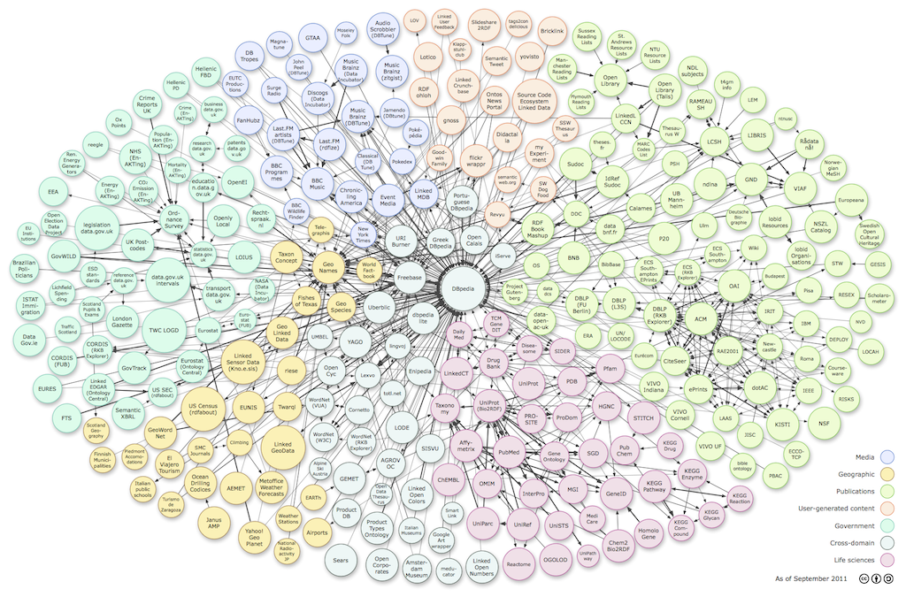

> このファイルは著者による非公式版です。学術論文等へ引用される場合には、正式版の論文（「情報処理」2013年12月号掲載）を必ずご参照ください。（大向一輝. オープンデータとLinked Open Data. 情報処理. 2013, vol. 54, no. 12, p. 1204-1210.）

# オープンデータの技術面 #

ウェブを通じたデータの積極的な公開・共有を目指すオープンデータを進めるにあたっては、ライセンスの選択やデータが作られる現場のワークフロー設計といった制度面における課題とともに、公開されるデータのフォーマットやアクセス方法などの技術面での検討が必要である。実際にオープンデータを利用するユーザの観点からは、入手が容易であり、処理のしやすいデータほど活用されやすい傾向にあると思われる。ウェブ上に散在する多様なデータに対して統一的な手段でアクセスすることができ、そのデータが共通のルールに基づいて記述されているような環境の構築は、オープンデータの普及にとって重要な課題である。これに対して、文書の公開・共有手段として成功を収めたウェブの技術的方法論をデータに適用するLinked Open Data（LOD）が注目されている。本稿ではオープンデータを支える技術としてのLinked Open Dataについて述べ、今後の展望について議論する。

# オープンデータとLinked Dataの交点 #

オープンデータは単にデータを公開することではなく、二次利用や商用利用が認められた形でのデータ提供を指す。データにオープンライセンスを付与することは、第三者による情報の利活用を実現するための最低条件であるといえる。一方、オープンライセンスが付与されてさえいれば自動的にデータの利用が活性化されるとは限らない。現実には多くのウェブサイトにおける情報公開が、コピー＆ペーストが不可能な画像情報や、サイトごとにマークアップの仕方が大きく異なるHTML文書によって行われており、実際にデータが利用される機会は多くない。一部の先進的なウェブサービスではウェブAPIが提供されており、XMLやJSONといった構造化フォーマットでデータを得ることができるものの、サービス間で記法が統一されていないため、利用に際しては開発者が個別に対応する必要がある。

国内でデータ形式に関する議論が広まったきっかけは2011年3月の東日本大震災である。震災直後に電力不足の懸念が生じた際に、電力会社から電力供給量に関する情報が画像のみで提供されたことに端を発し、開発者らが再加工の可能なフォーマットでの配布を要求した結果、CSV形式での提供が行われることとなった[^1]。その数日後には電力供給状況を可視化するアプリケーションが多数開発され、データ形式の重要性が見直される契機となった[^2]。同月末には経済産業省が日本経済団体連合会に対し、震災関連情報のデータ形式を自動処理に適した方法で提供するよう依頼した[^3]。

[^1]: <http://www.tepco.co.jp/forecast/index-j.html>
[^2]: <http://itpro.nikkeibp.co.jp/article/NEWS/20110325/358756/>
[^3]: <http://www.meti.go.jp/policy/mono_info_service/joho/other/2011/0330.html>

オープンデータにおけるデータ形式の重要性を示した文書として、ウェブの提案者であるTim Berners-Leeによる5 star Open Dataがある。5 star Open Dataではオープンデータが満たすべき条件を5段階のステップとして表現している（図1）。

最初のステップとして、オープンライセンスを付与してウェブ上に公開されたデータには1つ星が与えられる（OL: Open License）。1つ星のデータにおいてはフォーマットや形式はどのようなものでもよい。例としては画像化されたPDFが挙げられている。次に、機械可読で再利用可能なデータには2つ星が与えられる（RE: Reusable）。表形式のデータであればMicrosoft Excel形式で公開されたファイルなどがこれにあたる。非独占的なフォーマットで公開されているデータには3つ星が与えられる（OF: Open Format）。3つ星の例としてはCSVやXMLが挙げられている。なお、.docxや.xlsxなどの拡張子を持つOffice Open XML（OOXML）はISO/IECで標準化されているため3つ星に相当する。4つ星のデータは、URIを用いて個々のデータを表現することで外部からのリンクが可能なものを指す（URI: Uniform Resource Identifier）。さらに、5つ星のデータでは他のデータへのリンクが必須となる（LD: Linked Data）。

このステップの中で、4つ星ならびに5つ星はLinked Dataの概念に基づくデータ表現である。Linked Dataはセマンティックウェブ技術の応用として、データの意味論をRDF（Resource Description Framework）・RDFスキーマ・OWL（Web Ontology Language）を用いて記述する。Linked Dataについては文献[1]をはじめとして本誌2011年3月号の特集「リンクするデータ」に詳しい。ここではTim Berners-LeeによるLinked Dataの4原則[2]を確認するに留める。

1. あらゆる事物の識別子にURIを使用する
2. 識別子にはHTTP URIを使用する
3. URIにアクセスすると事物に関する構造化データが得られる
4. 構造化データには他の事物へのリンクを含む

これらの仕組みを用いることで、HTMLとハイパーリンクによる「文書のウェブ（Web of Documents）」と同様の「データのウェブ（Web of Data）」を構築することがLinked Dataの目標である。

なお、Linked Data自体はデータ形式に関する技術的方法論であり、対象とするデータがオープンであるかどうかはこだわらない。その意味でオープンデータとLinked Dataは直交した概念であり、5 star Open Dataにおいて4つ星、5つ星にLinked Dataの要素が含まれているのは適切でないとの批判もある。しかしながら、情報源ごとにデータ形式が異なっていることが情報の利活用を妨げているのは事実であり、データ形式の標準化とリンクによって新たな情報空間を構築するというビジョンを支持する声も大きい。データ同士をつないで再利用性を高めるというLinked Dataの考え方は、オープンガバメントの旗手ともいえる米国連邦政府のdata.govならびに英国政府のdata.gov.ukにおいても強く支持されている。本稿では、このLinked Dataの技術に基づくオープンデータ、すなわちLinked Open Data（LOD）について述べていく。

# Linked Open Dataの現在 #

LODに対応するウェブサイトは年々増加している。本稿ではこれらのサイトにて提供されているデータ群をデータセットと呼ぶ。データセットの総数や全体的な傾向はLOD cloud diagramで見ることができる（図2）。この図では、個々のノードがデータセットに対応し、エッジがデータ同士のリンク関係に相当する。また、データセットはMediaやGeographic、Governmentなど7種類に分類され、色分けされている。

LOD cloud diagramには、英国Open Knowledge Foundationが運営するオープンデータのカタログサイトDatahub[^4]に登録されているデータセットの中から、所定の条件を満たすものが登録されている。データセットの総数は2007年5月にはわずか12個であったが、2008年9月には45個、2010年9月には203個、最新版である2011年9月には295個となっており、急速に増加していることが確認できる。また、LOD cloud diagramへの掲載を希望するサイトの審査結果が公開されており、未登録のデータセットが200以上存在していることがわかる[^5]。

[^4]: <http://datahub.io>
[^5]: <http://validator.lod-cloud.net>

データセットの性質や特徴については文献[3]で詳細な分析がなされているので参照されたい。ここでは、データへのアクセス方法に関する調査結果についてのみ述べる。一般に、LODはファイルまたはSPARQLエンドポイントと呼ばれるデータベースのインターフェイスを通じて公開される。SPARQLはW3Cによって標準化されたRDFデータに対するクエリ言語である[^6]。SPARQLエンドポイントが利用できる場合にはクエリを記述し、エンドポイントに投入することで必要なデータのみを入手することができるが、提供側があらかじめデータベースを用意する必要がある。ファイルによる公開は提供側にとって容易である一方、データの処理コストを利用者側が負担しなければならない。LOD cloud diagramの分析によれば、295のサイトのうち201のデータセットがSPARQLに対応している。また、Datahubの登録情報の中では485のSPARQLエンドポイントが存在している。利用者の求めに応じてデータの提供方法が高度化していることがわかる。

LOD cloud diagramの中心に位置し、多くのリンクを獲得しているデータセットがDBpediaである[^7]。DBpediaはWikipediaのコンテンツに含まれるInfoboxに注目し、LODを自動生成して提供するサービスである。SPARQLエンドポイントも用意されている。Wikipedia自体が事実情報を収集しており、記事数も多いことから、他のデータセットがDBpediaの該当エントリにリンクする例が多い。

[^6]: <http://www.w3.org/TR/sparql11-overview/>
[^7]: <http://dbpedia.org>

DBpedia以外で大規模なデータ公開を行っている例としてEuropeanaがある。EuropeanaはEU圏の図書館・博物館・美術館が持つ計2000万以上の作品情報を集約・公開するサービスだが、実験的プロジェクトしてすべてのデータがLOD化され、自由に利用することができる[^8]。Europeanaに限らず、学術分野はLOD cloud diagramの7分野の1つに数えられるほど積極的な対応がなされており、図書館の総合目録サービスWorldCatや電子ジャーナルのIDを管理するCrossRefなどの大規模サービスにおいて書誌情報のLOD化が進んでいる。

[^8]: <http://pro.europeana.eu/linked-open-data>

# 日本のLinked Open Data #

2011年9月版のLOD cloud diagramにおいて、日本からは国立国会図書館によるWeb NDL Authorities（NDLA: 典拠データ検索・提供サービス）[^9]の1サイトのみに留まる。NDLAは蔵書管理のために著者名やキーワードを体系的に整備したもので、これをLODとして利用することができる。SPARQLエンドポイントも提供されており、LODの先進例の1つであるといえる。

[^9]: <http://id.ndl.go.jp/auth/ndla>

世界の潮流と軌を一にして、国内でもLinked DataないしLODに対応しているサイトは順調に増加している。図3は情報・システム研究機構の加藤文彦氏が作成した日本版LOD cloud diagramである。この図にはLODの定義にあてはまらない、ライセンスが明確でないデータセットも含まれるが、データのウェブが着実に育っていることが理解できる。

2012年5月には筆者が関わる国立情報学研究所LODACプロジェクトによって、Wikipedia日本語版を対象としたDBpedia Japaneseがリリースされ、日本のLODのハブになっている[^10]。また、Wikipedia日本語版のリンク関係からInfoboxには現れない概念間の関係を抽出し、利用可能にするWikipediaオントロジー[^11]やWikipediaシソーラス[^12]、日本語WordNetのLOD化などのプロジェクトもあり[^13]、基盤となるデータの整備は進んでいるといえる。

[^10]: <http://ja.dbpedia.org>
[^11]: <http://www.wikipediaontology.org>
[^12]: <http://dev.sigwp.org/WikipediaThesaurusV3/>
[^13]: <http://wordnet.jp/repositories/wordnet-ja>

データの作成を支援する仕組みとして、理化学研究所ではスプレッドシートをアップロードするとRDFに自動的に変換・公開するLinkDataを提供している[^14]。LinkDataは福井県鯖江市をはじめとする地方自治体のLOD公開手段としても広く利用されている。

[^14]: <http://linkdata.org>

政府レベルのオープンデータに関しては、経済産業省のOpen DATA METIにおいて、試験的に一部のデータをLOD化し、公開している事例がある[^15]。総務省が管轄する統計センターでは、市町村合併などによって複雑な体系を持つ標準地域コードをLODでモデル化するための検討が行われている。内閣官房が2013年度後半に公開するオープンデータカタログでは、メタデータがLODとして利用可能になる予定である。学術情報分野では大規模なデータベースでのLODの採用が進んでおり、NDLAに続いて国立国会図書館サーチ・東日本大震災アーカイブ、国立情報学研究所のCiNii・KAKENなどでデータを利用することができる。
 
[^15]: <http://datameti.go.jp/data/dataset/statistics_kougyou_2010>

# Linked Open Dataを使う #

先に述べたとおり、LODの技術的なメリットは、標準化された知識表現形式（RDF）とデータアクセス手段（SPARQL）が提供されることにある。これらの標準に基づくライブラリを用いることで、開発者は取得やパースの手間を大幅に軽減できる。またSPARQLについてはオープンソースならびに商用のデータベース（RDFストア）が多数開発されており、手持ちのLODをRDFストアに投入すればSPARQLエンドポイントとして機能するため、柔軟な問い合わせができる環境を容易に構築可能である。ここではLODを活用したアプリケーションを用途ごとに紹介する。

## ブラウズ・検索 ##

LODはグラフ構造を持つだけでなく、データセット間のリンクも多いことから、全体的なスキーマを把握することは難しい。よってデータの閲覧は探索的にならざるを得ない。TabulatorはLODの取得と表示に特化したブラウザ用のアドオンであり、LODに対してウェブページと同じようにクリックによるデータの遷移を可能にする[^16]。DashSearch LDはSPARQLエンドポイントに対して対話的に操作を行い、データ構造を理解しながら目的のデータを入手できるよう支援するウェブサービスである[4]。また、一般のウェブ検索エンジンと同様に、あらかじめウェブ上のRDFやLODを収集し、キーワードや属性で検索できるSindiceのような検索サービスもある[^17]。Sindiceには7億以上のデータが格納されている。

[^16]: <http://www.w3.org/2005/ajar/tab>
[^17]: <http://sindice.com>

## マッシュアップ ##

LODによってデータ形式やアクセス方法が標準化されていることから、既存の情報源を組み合わせたサービス、すなわちマッシュアップの開発コストは極めて低くなることが期待される。初期のマッシュアップの代表例として、携帯端末向けに地図情報とDBpediaの施設情報を組み合わせたDBpedia Mobileを挙げることができる[^18]。DBpediaの情報はSPARQLを通じて入手するため、エンドポイントの設定を変えることで他のデータセットの情報に差し替えることが容易である。

[^18]: <http://dbpedia.org/DBpediaMobile>

実際に複数のデータセットを利用したサービスを構築した例として、横浜市内の芸術関連情報を地図から探せるサービスであるヨコハマアートスポットがある[5]。国立情報学研究所LODACプロジェクト、横浜市芸術文化振興財団、NTTレゾナントがそれぞれ提供しているSPARQLエンドポイントから施設・収蔵品・イベント・口コミなどの情報を取得し、ユーザの要求に応じて関連情報を表示する。個々のデータセットは異なる組織によって維持・管理されており、スキーマも大きく異なるが、サービスの実装にあたっては、施設情報のURIを共通化するなどの前処理以外には調整の必要がなく、SPARQLを用いて速やかな開発・提供を行うことができた。

横浜市金沢区のかなざわ育なび.netでは、区役所内で部署ごとに管理されているデータをLOD化し、子育てに必要な情報を部署の枠を超えて一括で検索・閲覧することのできるサービスを提供している[^19]。各々の部署においてデータを作成するためのワークフローやフォーマットを変えることは困難だが、すでに作成されたデータをLODに変換し、SPARQLエンドポイントに投入する機構を追加することで現場の負荷を最小限に留めたままデータの標準化を可能にしている。

[^19]: <http://kirakana.city.yokohama.lg.jp>

## LODチャレンジ ##

LODの利活用を促進するために、有志によってコンテスト形式のLinked Open Dataチャレンジ（LODチャレンジ）が開催されている[^20]。2011年から開催が始まり、現在（2013年10月）は第3回の募集が行われている。LODチャレンジの特徴は、アプリケーションだけを募集するのではなく、LODの利活用アイデアやデータを用いた可視化手法も同時に募集することで、開発者でない層に対して門戸を広げていることにある。また、特筆すべきは自作のデータを募集するデータ部門の存在である。一般的に、データ作成はアプリケーション開発と同様に労力が大きいものの評価の対象になりにくい。そこで、LODチャレンジではデータ公開を活性化させることを目的としてこのような部門が設置されている。

[^20]: <http://lod.sfc.keio.ac.jp>

第1回はデータ部門が21件、アイデア部門が34件、アプリケーション部門が18件の計73件の応募であったのに対して、第2回にはデータ部門が87件、アイデア部門が50件、アプリケーション部門が44件、新設の可視化部門が24件の計205件と3倍近い応募があった。応募されたデータを用いて別の参加者がアプリケーションを作成するという、データを介した間接的なコラボレーションが起こるなど、事前の想定を超える成果も生まれている。

データ部門の受賞作品に注目すると、東日本大震災時にボランティアが作成した図書館・博物館などの社会教育施設の全件リストをLOD化したsaveMLAK[^21]や、アニメーション作品の舞台となっている地域の位置情報など[^22]、政府・地方自治体にとってデータ作成の負荷が極めて大きいものや、ポップカルチャーなどの新たな分野のデータが散見されるのが興味深い。

2013年度はLODチャレンジ以外にもアーバンデータチャレンジ東京[^23]やオープンデータ・ビッグデータ活用推進協議会のアイデアコンテスト[^24]など多数のコンテストが開催されている。これらは必ずしもLODに限定されたものではないが、オープンデータの利活用そのものの有効性が評価される時期にあると思われる。

[^21]: <http://savemlak.jp>
[^22]: <http://cheese-factory.info/lod.html>
[^23]: <http://aigid.jp/GIS/udct/2013/>
[^24]: <https://www.facebook.com/bigdataopendata4city>

# 課題と展望 #

これまで述べてきたように、LODがもたらす「データのウェブ」は拡大を続けており、それに伴って利活用の機会も増加している。一方で、LODはデータセット間にリンクが存在しなければ質的な向上が見込めず、またこの作業が最も困難である。

LODは原理上すべての事物にURIをつける必要があり、同じURIを持つリソースはどのデータセットに存在していたとしても同じものであるという唯一名仮説に基づいている。ただし、個々のウェブサイトあるいはデータセットがボトムアップに構築されるウェブにおいて、異なるデータセットに存在する同じ事物に同じURIがつけられる可能性は極めて低い。すでに異なる識別子がつけられているが、同じものであると見なしたい一対のリソースがある場合には、それらのリソースを「同じである」または「類似している」という意味のプロパティ、具体的にはowl:sameAs、skos:exactMatch、skos:closeMatchなどを用いてリンクする必要がある。

しかしながら、何をもって「同じである」と見なすことができるかの判断が難しい。名前あるいはラベルが同一であるだけでは同じものであるとは確定できない場合も多く、このような場合にはデータの内容を逐一確認して同一性の判定を行わなければならない。いわゆる名寄せ処理を大規模なデータセット群に対して適用するために機械学習などの手法が使われることが多く、一定の成果は得られるものの、少数のエラーが出ることは避けられない。分野によってはエラーが許されないこともあり、その際には人手での確認が必要となるが、コストが増大する恐れがある。一方、名前だけで同一性を判定できるような分野もある。これは対象分野において曖昧性を回避する命名ルールが確立されている場合であり、リンク付けの実行者はその知識を事前に理解しているかどうかによって想定される作業の規模が大きく変わる。

同一性の問題以外にも課題は多い。LODはグラフ構造を持つが、現在オープンデータの一環として提供されるデータは統計表などスプレッドシートで作成されたものが多い。統計表のデータをシリアライズするにはSDMXと呼ばれる規格があり[^25]、このモデルをLODで扱うためのData Cube語彙が提案されている[^26]。しかし、一般的に表形式のデータをグラフに変換すると表現が冗長になり、可読性が下がる傾向にある。そのため、このような表形式データのLOD化に際しては、そのメリットを理解し、必要に応じてメタデータだけをLOD化するなど、コストパフォーマンスを考慮した対応が必要になる。逆に、スプレッドシートのソフトウェアはその柔軟性の高さゆえに曖昧な構造のデータを作ることも可能である。その際には本来の構造を表現できるようなモデル化を行わなければならず、もとのデータから自動的に変換が可能かといったことを検証する必要がある。

[^25]: <http://sdmx.org>
[^26]: <http://www.w3.org/TR/vocab-data-cube/>

これらの問題に対しては、分野に関する専門知識を持ち、かつコンピュータに精通した人物が適切に判断し、開発者と分業しながら大規模かつ継続的にデータを維持管理する体制が作られることが望ましい。そのためには、「データキュレーション」とも呼ぶべきスキルセットを定義し、そのようなスキルを持つ人材を組織的に育成する必要がある。LODのポテンシャルを発揮させるためには、このコストを誰がどのように負担すべきかが大きな課題となる。LODの元になるデータがオープンであれば、必ずしもデータキュレーションはデータの持ち主の仕事ではなく、ビジネスとしてアウトソースされるものになる可能性もある。

近年、ウェブ上の構造化データは質・量ともに向上しており、ウェブ検索エンジンにおいてはGoogleのKnowledge Graphに代表されるセマンティクスに基づくナビゲーションの提供事例や、IBMのWatsonのように特定分野のQ&Aを人工知能技術で行うための基礎データとして取り入れられることも増えている[6]。LODならではのキラーアプリケーションが求められている状況ではあるが、地道かつ着実なデータ整備の活動との両輪で進めていくことが必要であろう。

# 参考文献 #

[1] C. Bizer, T. Heath, T. Berners-Lee, 萩野達也（翻訳）: Linked Dataの仕組み, 情報処理, Vol.52, No.3, pp.284-292 (2011).

[2] T. Berners-Lee: Linked Data - Design Issues, <http://www.w3.org/DesignIssues/LinkedData.html> (2006).

[3] C. Bizer, A. Jentzsch, R. Cyganiak: State of the LOD Cloud, <http://lod-cloud.net/state/> (2011).

[4] T. Goto, H. Takeda, M. Hamasaki: DashSearch LD: Exploratory Search for Linked Data, Proceedings of the 2nd Joint International Semantic Technology Conference (2012).

[5] 松村冬子, 小林巌生, 嘉村哲郎, 加藤文彦, 高橋徹, 上田洋, 大向一輝, 武田英明: Linked Open Dataによる博物館情報および地域情報の連携活用, 情報処理学会人文科学とコンピュータシンポジウム論文集, pp.403-408 (2011).

[6] Y. Ni, L. Zhang, Z. Qiu, C. Wang: Enhancing the Open-Domain Classification of Named Entity Using Linked Open Data, The Semantic Web - ISWC 2010, pp.566-581 (2010).

> このファイルは著者による非公式版です。学術論文等へ引用される場合には、正式版の論文（「情報処理」2013年12月号掲載）を必ずご参照ください。（大向一輝. オープンデータとLinked Open Data. 情報処理. 2013, vol. 54, no. 12, p. 1204-1210.）
